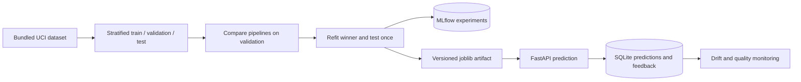

# ML Prediction and MLOps Platform

Train and compare classification models, record experiments in MLflow, serve a versioned model through FastAPI, and inspect drift and observed-label performance from incoming predictions.

**Stack:** Python 3.11+, scikit-learn, pandas, NumPy, SciPy, FastAPI, MLflow, SQLite, Docker, pytest, GitHub Actions.

## Existing implementation

- Wisconsin Diagnostic Breast Cancer dataset: 569 examples, 30 numeric features; positive label explicitly mapped to malignant.
- Stratified 60/20/20 train/validation/test split with seed 42. Logistic regression with training-only scaling and a random forest are compared on validation ROC AUC.
- Winner refitted on training + validation, then evaluated once on the untouched test split.
- MLflow parameters/metrics/artifact logging; deterministic model version derived from the evaluation report.
- Batched prediction endpoint with schema and finite-value validation; model feature order and evaluation exposed through `/model`.
- Persistent prediction/feedback storage; per-model monitoring windows; KS drift checks after 30 predictions with a practical-effect threshold and Bonferroni correction.
- Optional API-key protection, readiness endpoint, browser client, container orchestration, and CI tests/container build.



## Run locally

```bash
git clone https://github.com/abiy8/ml-prediction-mlops.git
cd ml-prediction-mlops
python -m venv .venv
source .venv/bin/activate
# Windows PowerShell: .venv\Scripts\Activate.ps1
pip install -r requirements.txt
python train.py
uvicorn app.main:app --reload
```

Open http://localhost:8000 for the demo or `/docs` for the API. `train.py` writes `artifacts/model.joblib`, `reports/evaluation.json`, and MLflow runs to `data/mlflow.db`. No dataset download or external credentials are needed.

To view tracked runs separately:

```bash
mlflow server --host 127.0.0.1 --port 5000 --backend-store-uri sqlite:///data/mlflow.db
python -m pytest -q
```

Environment variables: `MODEL_PATH`, `MONITOR_DB`, `MLFLOW_TRACKING_URI`, and `API_KEY`. The API returns HTTP 503 for model endpoints until a trained artifact exists. Python commands do not automatically load `.env`.

## Docker and deployment

```bash
cp .env.example .env
# Choose a random API_KEY before sharing the API.
docker compose up --build
```

Compose first runs training, then starts the API on localhost:8000 and MLflow on localhost:5000 with persistent named volumes. For a cloud VM, use the same container image behind HTTPS, retain the model/data volumes, set `API_KEY`, and restrict access to the MLflow port. There is no live cloud deployment or automatic cloud provisioning in this repository. The CI workflow tests and builds an image; it does not deploy it.

## API

| Endpoint | Purpose |
| --- | --- |
| `GET /health` | Model readiness/version |
| `GET /model` | Feature order and measured evaluation |
| `POST /predict` | `{"rows": [[30 feature values], ...]}`; up to 100 rows |
| `POST /feedback` | `{"prediction_id":"returned-id","label":1}` |
| `GET /monitor` | Drift and observed-label performance for current version |

The browser includes a valid sample row. Add `X-API-Key` when configured. Inputs must follow feature order exactly; application-specific range validation is left to the caller.

## Evaluation and limitations

See [`reports/evaluation.json`](reports/evaluation.json) for measured metrics, split sizes, model selection, and confusion matrix. All preprocessing stays inside the fitted pipeline. Results are one seeded holdout, not external validation.

This is an **educational benchmark, not a medical diagnostic tool**. Drift flags indicate a distribution change; they do not prove degraded model quality. Quality metrics require submitted labels. Monitoring has a maximum 1,000-prediction window and does not implement retention jobs, multi-tenant access, alert delivery, automatic retraining, or model-registry promotion. Load only trusted local joblib artifacts because pickle-based formats can execute code.

The [UCI dataset](https://archive.ics.uci.edu/dataset/17/breast+cancer+wisconsin+diagnostic) originates from W. H. Wolberg, W. N. Street, and O. L. Mangasarian; scikit-learn provides the bundled copy. Original platform code is MIT licensed.

### Recorded holdout results (2 October 2026)

Validation selected logistic regression. On 114 held-out records: ROC AUC **0.9960**, average precision **0.9943**, accuracy **96.5%**, malignant-class F1 **95.1%**. Confusion matrix (actual rows / predicted columns: benign, malignant): `[[71,1],[3,39]]`. These are benchmark results, not clinical performance.
